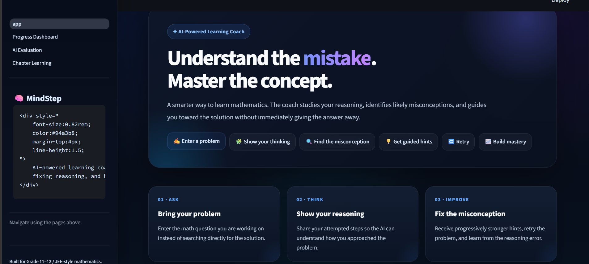
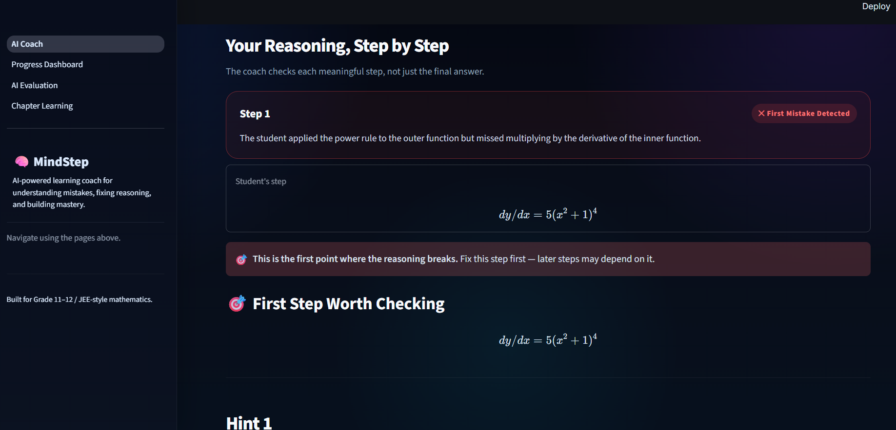
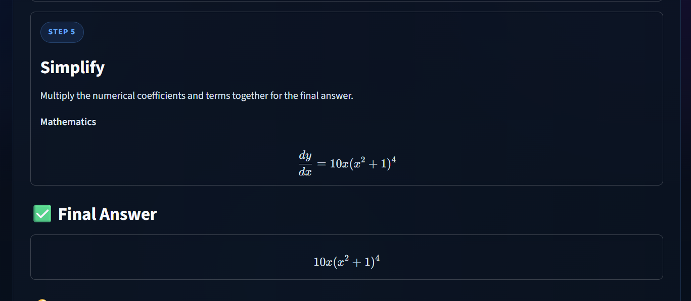
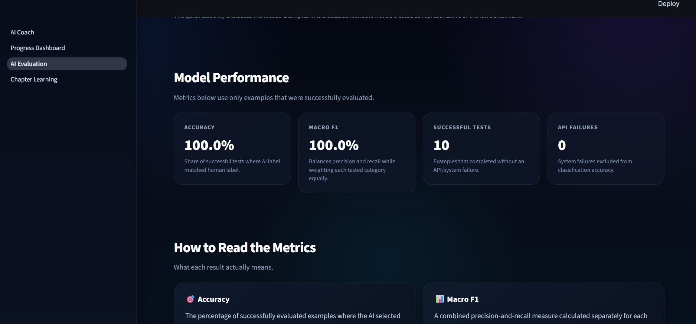
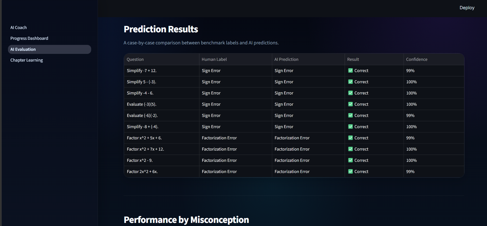
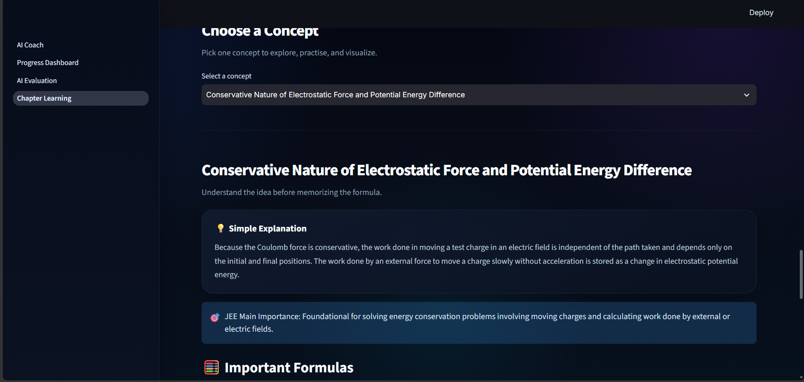

# 🧠 MindStep — AI Learning Coach

MindStep is an AI-powered learning coach that helps students understand **where their reasoning went wrong**, not just whether their final answer was correct.

Instead of immediately revealing solutions, MindStep identifies likely misconceptions, gives progressive hints, lets students retry, and only reveals a full explanation after they have had a chance to repair their reasoning.

The project currently focuses on Grade 11–12 and JEE-style mathematics.

---
## 📸 Screenshots

### AI Coach Home



### Mistake Analysis



### Corrected Solution



### Progress Dashboard



### AI Evaluation



### Chapter Learning



A student can:

1. Enter a mathematics problem.
2. Show their attempted solution.
3. Let MindStep analyze the reasoning step by step.
4. Identify the first likely mistake.
5. Receive a hint without immediately seeing the answer.
6. Retry the problem.
7. Receive stronger hints if needed.
8. View a structured full explanation.
9. Track recurring mistakes and weak topics.
10. Review learning progress through a dashboard.

---

## ✨ Main Features

### 🧩 Misconception Detection

MindStep classifies likely reasoning errors into categories such as:

- Sign errors
- Fraction errors
- Distribution errors
- Factorization errors
- Equation balancing errors
- Arithmetic errors
- Exponent-rule errors
- Algebraic manipulation errors
- Formula-selection errors
- Conceptual misunderstandings
- Domain restriction errors
- Trigonometry errors
- Logarithm errors
- Function errors
- Limit errors
- Derivative errors
- Integration errors
- Coordinate geometry errors
- Sequence and series errors
- Matrix errors
- Probability errors
- Permutation and combination errors

---

### 🎯 First Wrong Step Detection

Instead of only checking the final answer, MindStep attempts to identify the first meaningful point where the student's reasoning breaks.

This helps the student understand the cause of the mistake rather than simply correcting the final line.

---

### 💡 Progressive Hint System

MindStep does not immediately reveal the full solution.

The learning flow is:

**Hint 1 → Retry → Hint 2 → Retry → Hint 3 → Full Explanation**

The goal is to encourage students to think through the problem before seeing the answer.

---

### 🔁 Retry-Based Learning

Students can submit an improved solution after receiving a hint.

MindStep then analyzes the new reasoning again and checks whether the misconception has been repaired.

---

### 📚 Structured Step-by-Step Explanations

When the full explanation is unlocked, MindStep presents the solution in readable teaching steps.

For example:

- Identify the mathematical structure
- Apply the correct rule
- Work through the intermediate reasoning
- Simplify
- Present the final answer

Mathematical expressions are rendered using LaTeX for readability.

---

### 🧮 Hybrid AI + Symbolic Reasoning

MindStep combines:

- Large-language-model reasoning
- Structured prompting
- SymPy symbolic mathematics
- Step parsing
- Misconception classification
- Rule-based verification

This hybrid approach helps the system evaluate mathematical reasoning rather than relying only on natural-language generation.

---

## 📊 Progress Dashboard

MindStep stores learning attempts and converts them into useful learning signals.

The dashboard includes:

- Total attempts
- Success rate
- Topics practiced
- Misconception types
- Stronger topics
- Topics needing more practice
- Topic-level success rates
- Most common misconceptions
- Recent learning activity
- Suggested next practice area

The dashboard is designed to become more useful as more attempts are recorded.

---

## 🧪 Model Evaluation

MindStep includes its own evaluation page for testing the misconception detector.

The evaluation system compares:

**Human-labeled misconception → AI-predicted misconception**

Metrics include:

- Accuracy
- Precision
- Recall
- Macro F1
- Per-category performance
- Confusion matrix
- Misclassified examples
- API failures

The current benchmark uses a manually constructed labeled dataset.

The project also explicitly documents limitations rather than presenting benchmark scores as proof of perfect performance.

---

## 📖 Chapter Learning

MindStep also includes a chapter-learning mode.

Students can upload a PDF chapter and use AI to:

- Extract chapter content
- Identify key concepts
- Generate a chapter map
- Extract formulas
- Explain concepts
- Generate practice questions
- Create animation storyboards
- Render simple educational animations using Manim

This extends MindStep beyond solving individual questions into broader chapter-level learning.

---

## 🏗️ System Architecture

A simplified view of the project:

```text
Student
   │
   ▼
Streamlit Interface
   │
   ├── Question
   └── Attempted Solution
   │
   ▼
Reasoning Analysis Pipeline
   │
   ├── Step Extraction
   ├── SymPy Verification
   ├── Gemini Analysis
   └── Misconception Classification
   │
   ▼
Learning Coach
   │
   ├── First Wrong Step
   ├── Diagnosis
   ├── Hint 1
   ├── Hint 2
   ├── Hint 3
   └── Structured Explanation
   │
   ▼
Storage + Analytics
   │
   ├── Learning History
   ├── Weak Topics
   ├── Strong Topics
   └── Misconception Patterns